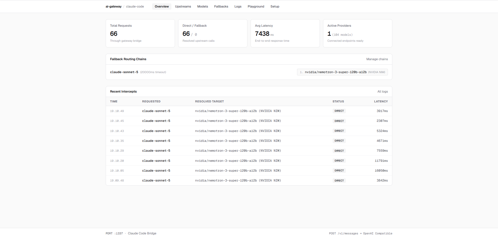
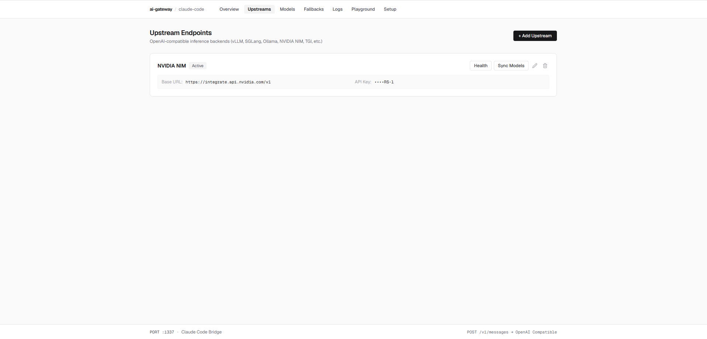
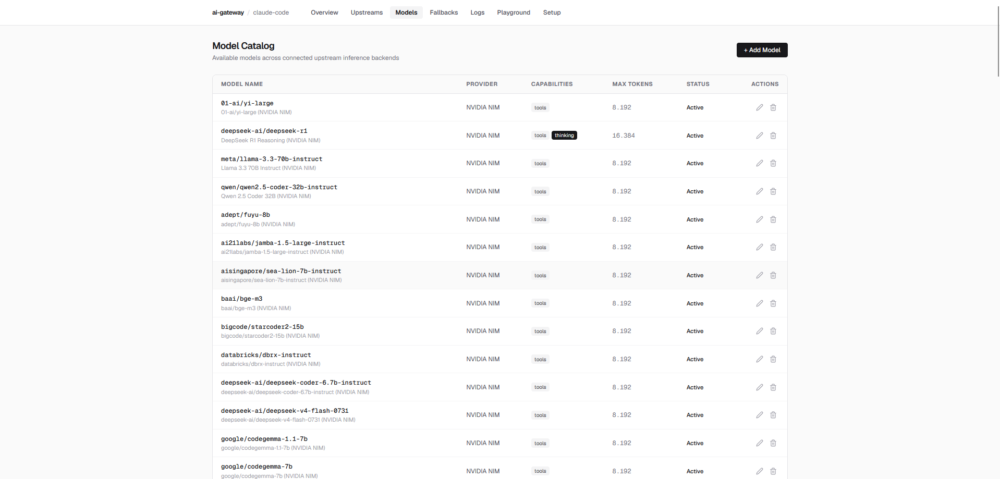
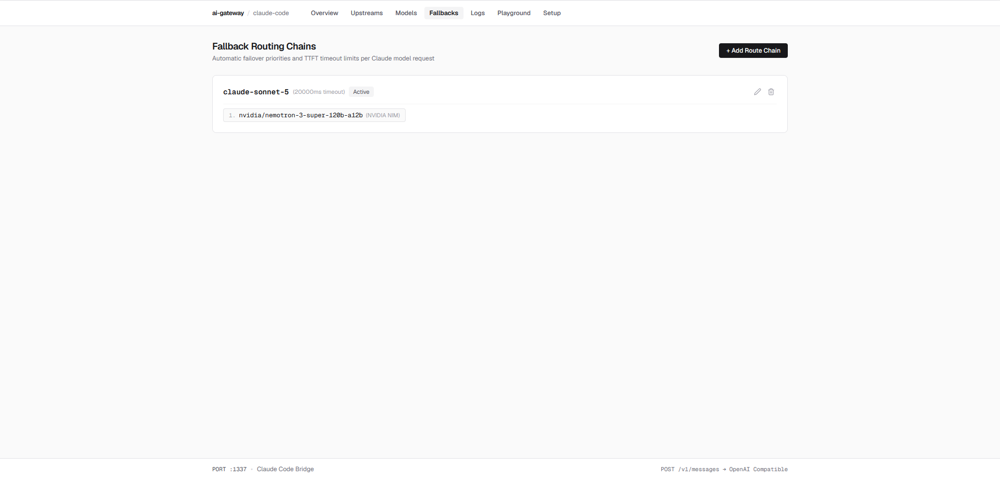
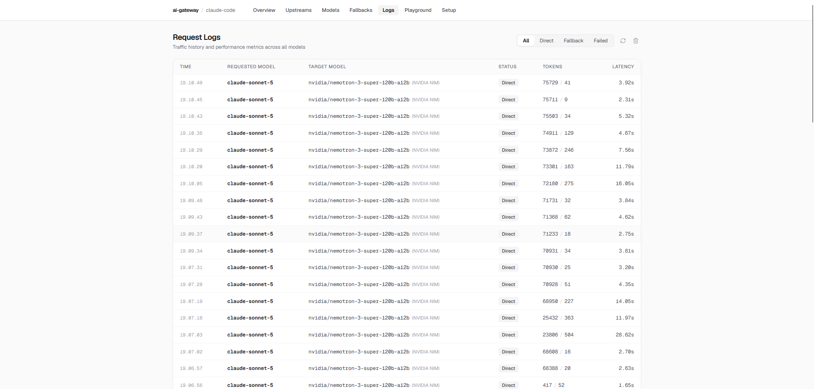
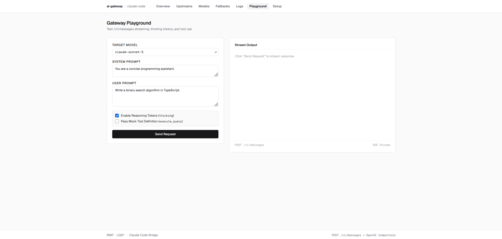
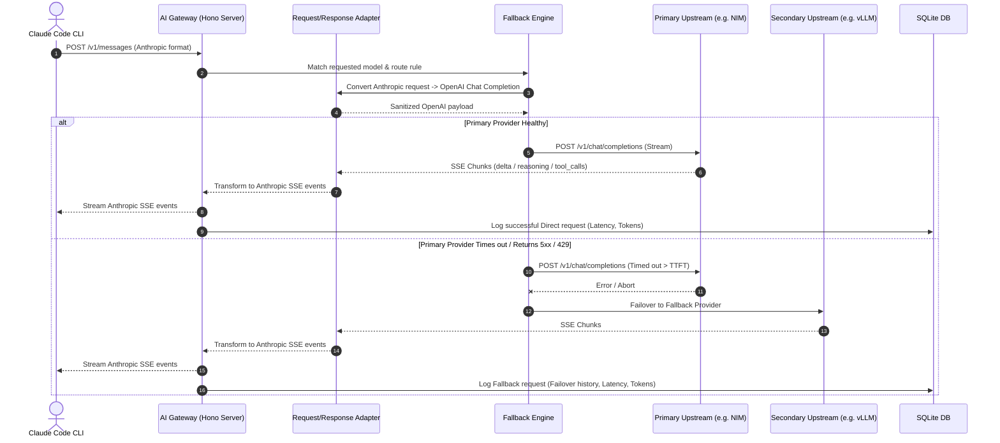

# 🤖 Claude Code AI Gateway & LLM Protocol Proxy

<div align="center">

[](https://nodejs.org/)
[](https://www.typescriptlang.org/)
[](https://reactrouter.com/)
[](https://hono.dev/)
[](https://sqlite.org/)
[](https://tailwindcss.com/)
[](#-testing)
[](LICENSE)

<p align="center">
  <strong>A high-performance, self-hosted AI Gateway that transparently translates Anthropic Messages API requests (such as Claude Code CLI) to any OpenAI-compatible inference backend with automatic fallback routing, reasoning token translation, and a real-time management dashboard.</strong>
</p>

</div>

---

## 📑 Table of Contents

- [Overview](#-overview)
- [Key Features](#-key-features)
- [Screenshots & UI Showcase](#-screenshots--ui-showcase)
- [Architecture & Request Flow](#-architecture--request-flow)
- [Getting Started](#-getting-started)
  - [Prerequisites](#prerequisites)
  - [Installation](#installation)
  - [Running the Gateway](#running-the-gateway)
- [Claude Code CLI Integration](#-claude-code-cli-integration)
- [Configuration & Environment Variables](#-configuration--environment-variables)
- [API Reference](#-api-reference)
  - [Anthropic Compatible Endpoints](#anthropic-compatible-endpoints)
  - [Admin & Monitoring Endpoints](#admin--monitoring-endpoints)
- [Production Deployment](#-production-deployment)
  - [PM2 Process Manager](#pm2-process-manager)
  - [Docker Container](#docker-container)
- [Testing](#-testing)
- [Tech Stack](#-tech-stack)
- [License](#-license)

---

## 🌟 Overview

**Claude Code AI Gateway** acts as an intelligent reverse proxy and protocol translator sitting between Anthropic-compatible clients (e.g., **Claude Code CLI**, Claude SDK, LibreChat, Cursor) and any **OpenAI-compatible inference backend** (e.g., **NVIDIA NIM**, **vLLM**, **SGLang**, **Ollama**, **OpenRouter**, **Together AI**, **Groq**, **TGI**).

It enables developers to use local or enterprise LLMs within developer tools designed exclusively for Anthropic models without altering the client code.

```
+-----------------------------------------------------------------------------------+
|  Claude Code CLI / Anthropic SDK                                                  |
|  POST /v1/messages  (Anthropic Schema, System, Tools, Thinking Tokens)            |
+-----------------------------------------+-----------------------------------------+
                                          |
                                          v
+-----------------------------------------------------------------------------------+
|  Claude Code AI Gateway (:1337)                                                   |
|  * Protocol Adapter (Anthropic <-> OpenAI format)                                 |
|  * Fallback Router & TTFT Timeout Supervisor                                      |
|  * SSE Realtime Stream Transformer                                                |
|  * Reasoning Content & Tool Call Sanitizer / JSON Repair                          |
|  * SQLite Persistence & React Router v8 Admin Dashboard                           |
+-----------------------------------------+-----------------------------------------+
                                          |
        +---------------------------------+---------------------------------+
        |                                 |                                 |
        v                                 v                                 v
+---------------+                 +---------------+                 +---------------+
|  NVIDIA NIM   |                 |     vLLM      |                 |    Ollama     |
| (Primary)     | ---(Failover)-->| (Fallback 1)  | ---(Failover)-->| (Fallback 2)  |
+---------------+                 +---------------+                 +---------------+
```

---

## 🚀 Key Features

- **🔄 Full Anthropic ↔ OpenAI Protocol Translation**
  - Complete support for `/v1/messages` and `/v1/messages/count_tokens`.
  - Bidirectional transformation for streaming Server-Sent Events (SSE): translates OpenAI chunks into `message_start`, `content_block_start`, `content_block_delta`, `message_delta`, and `message_stop` events.

- **🧠 Reasoning & Thinking Tokens Translation**
  - Seamless handling of reasoning models (**DeepSeek-R1**, **Qwen Reasoning**, **Nemotron**, etc.).
  - Extracts `<think>` blocks and OpenAI `reasoning_content` delta fields and converts them into native Anthropic `thinking` content blocks.

- **🛠️ Resilient Tool Calling & JSON Repair**
  - Translates Anthropic tool schemas and `tool_use` / `tool_result` messages to OpenAI function definitions and responses.
  - Built-in regex and JSON repair engine automatically corrects malformed JSON arguments, dangling commas, single quotes, and code fences emitted by upstream models.

- **🔀 Intelligent Fallback Routing Chains**
  - Configure multi-tier failover chains per requested model (e.g., `claude-sonnet-5` → `nvidia/nemotron-3-super-120b-a12b` → `deepseek-r1`).
  - Configurable Time-To-First-Token (TTFT) timeouts: if the primary upstream stalls, times out, or returns 429/5xx errors, the request instantly fails over to the next provider.

- **🌐 Provider & Model Catalog Management**
  - One-click auto-discovery and synchronization of upstream models from OpenAI-compatible `/v1/models` endpoints.
  - Granular control over capabilities per model (Tool Use, Reasoning Tokens, Vision, Max Output Tokens).

- **📊 Real-time Observability & Request Logs**
  - Embedded audit logging via `better-sqlite3`.
  - Tracks requested model, resolved upstream model, execution status (Direct / Fallback / Failed), token counts (input/output), and end-to-end latency.

- **🧪 Interactive Gateway Playground**
  - In-browser sandbox to test model streaming, reasoning token extraction, and mock tool definitions without launching terminal CLI tools.

- **⚡ Modern, Ultra-Fast Fullstack Architecture**
  - Built on **Hono** node-server for microsecond API routing.
  - Server-Side Rendered (SSR) Dashboard powered by **React Router v8**, **React 19**, and **Tailwind CSS v4**.

---

## 📸 Screenshots & UI Showcase

| 1. Overview & Health Metrics | 2. Upstream Inference Endpoints |
| :---: | :---: |
|  |  |
| *Real-time statistics, active fallback routes, and recent intercept logs.* | *Manage upstream endpoints (NVIDIA NIM, vLLM, Ollama, etc.) and sync models.* |

| 3. Model Catalog & Capabilities | 4. Fallback Routing Chains |
| :---: | :---: |
|  |  |
| *Unified catalog with capability flags (Tools, Thinking, Max Tokens).* | *Configure priority chains and TTFT timeout failover rules per model.* |

| 5. Request Logs & Token Analytics | 6. Gateway Playground |
| :---: | :---: |
|  |  |
| *Detailed traffic history, latencies, token consumption, and status filters.* | *Interactive testing interface for streaming, reasoning tokens, and tools.* |

---

## 🏛️ Architecture & Request Flow



---

## 📦 Getting Started

### Prerequisites

- **Node.js**: `v20.0.0` or higher
- **npm** / **pnpm** / **yarn** / **bun**

### Installation

1. **Clone the repository:**
   ```bash
   git clone https://github.com/andika0x01/ai-gateway.git
   cd ai-gateway
   ```

2. **Install dependencies:**
   ```bash
   npm install
   ```

### Running the Gateway

#### Development Mode (with Hot Module Replacement)
```bash
npm run dev
```

#### Production Mode
```bash
# 1. Build the client and server assets
npm run build

# 2. Start the production server
npm start
```

The gateway server will be accessible at:
- 🌐 **Dashboard UI**: `http://localhost:1337/`
- 📡 **Anthropic API**: `http://localhost:1337/v1/messages`
- 🩺 **Health Check**: `http://localhost:1337/health`

---

## 💻 Claude Code CLI Integration

To use **Claude Code CLI** with this gateway, set the `ANTHROPIC_BASE_URL` environment variable pointing to your gateway instance.

### macOS / Linux / WSL (Bash & Zsh)
```bash
export ANTHROPIC_BASE_URL="http://localhost:1337"
export ANTHROPIC_API_KEY="gateway"
claude
```

> **Tip:** Add these exports to your `~/.bashrc` or `~/.zshrc` for persistence:
> ```bash
> echo 'export ANTHROPIC_BASE_URL="http://localhost:1337"' >> ~/.zshrc
> echo 'export ANTHROPIC_API_KEY="gateway"' >> ~/.zshrc
> ```

### Windows PowerShell
```powershell
$env:ANTHROPIC_BASE_URL="http://localhost:1337"
$env:ANTHROPIC_API_KEY="gateway"
claude
```

### Windows Command Prompt (CMD)
```cmd
set ANTHROPIC_BASE_URL=http://localhost:1337
set ANTHROPIC_API_KEY=gateway
claude
```

---

## ⚙️ Configuration & Environment Variables

The gateway is configured via environment variables and through the web dashboard.

| Variable | Type | Default | Description |
| :--- | :--- | :--- | :--- |
| `PORT` | `number` | `1337` | HTTP port on which the gateway server listens. |
| `DB_PATH` | `string` | `data/gateway.db` | Path to the SQLite database file. |
| `NODE_ENV` | `string` | `development` | Node environment (`development` or `production`). |

All providers, API keys, fallback routes, and model definitions are safely persisted in the SQLite database and can be edited in real-time through the UI or REST API.

---

## 🔌 API Reference

### Anthropic Compatible Endpoints

#### `POST /v1/messages`
Proxies and translates Anthropic Messages requests to configured OpenAI-compatible backends.
- Supports both streaming (`stream: true`) and non-streaming responses.
- Supports tools / function calling and thinking token blocks.

#### `POST /v1/messages/count_tokens`
Estimates token counts for input messages and tool definitions.

#### `GET /v1/models`
Returns list of official Anthropic model aliases supported by the gateway.

#### `GET /health`
Returns gateway health status, service name, and timestamp.

---

### Admin & Monitoring Endpoints

| Method | Endpoint | Description |
| :--- | :--- | :--- |
| `GET` | `/api/stats` | Retrieve aggregated gateway metrics (total requests, avg latency, providers count). |
| `GET` | `/api/providers` | List all configured upstream inference providers. |
| `POST` | `/api/providers` | Add a new upstream provider (e.g., NVIDIA NIM, vLLM, Ollama). |
| `POST` | `/api/providers/:id/test` | Test connectivity and latency to an upstream provider. |
| `POST` | `/api/providers/:id/discover-models` | Auto-discover and sync available models from upstream. |
| `GET` | `/api/models` | List all models across connected providers. |
| `POST` | `/api/models` | Create or update model capability flags (tools, thinking, vision). |
| `GET` | `/api/routes` | List all fallback routing chains. |
| `POST` | `/api/routes` | Create a new model routing rule with TTFT timeout & priority chains. |
| `GET` | `/api/logs` | Fetch paginated request logs with optional status filters (`Direct`, `Fallback`, `Failed`). |
| `DELETE`| `/api/logs` | Clear request logs history. |
| `POST` | `/api/test-gateway` | Test a message payload directly through the routing engine. |

---

## 🚀 Production Deployment

### PM2 Process Manager

A pre-configured `ecosystem.config.cjs` is included for zero-downtime production execution:

```bash
# 1. Build the production application
npm run build

# 2. Start with PM2
npm run pm2:start

# 3. View live logs
npm run pm2:logs

# 4. Restart or stop
npm run pm2:restart
npm run pm2:stop
```

### Docker Container

Build and run using Docker:

```bash
# Build Docker image
docker build -t ai-gateway .

# Run Docker container with persistent SQLite volume
docker run -d \
  -p 1337:1337 \
  -v $(pwd)/data:/app/data \
  --name ai-gateway \
  ai-gateway
```

---

## 🧪 Testing

The repository includes comprehensive unit and integration tests covering:
- Anthropic-to-OpenAI request translation & schema sanitization
- JSON repair & text-based tool extraction
- OpenAI-to-Anthropic streaming SSE transformer & reasoning token handling
- End-to-end auto-fallback routing engine under timeout/error conditions
- Token estimation & database repository operations

To run tests:

```bash
npm test
```

To run TypeScript typechecking:

```bash
npm run typecheck
```

---

## 🛠️ Tech Stack

- **Backend & API Server**: [Hono](https://hono.dev/) on Node.js (`@hono/node-server`)
- **Frontend & SSR Framework**: [React Router v8](https://reactrouter.com/) + [React 19](https://react.dev/)
- **Styling**: [Tailwind CSS v4](https://tailwindcss.com/) + [Lucide Icons](https://lucide.dev/)
- **Database**: [SQLite](https://sqlite.org/) via [`better-sqlite3`](https://github.com/WiseLibs/better-sqlite3)
- **SDK Integrations**: `@anthropic-ai/sdk`, `openai`
- **Process & Build Tooling**: [Vite 8](https://vitejs.dev/), [TSX](https://github.com/privatenumber/tsx), [PM2](https://pm2.keymetrics.io/)

---

## 📄 License

This project is open-source software licensed under the [MIT License](LICENSE).
